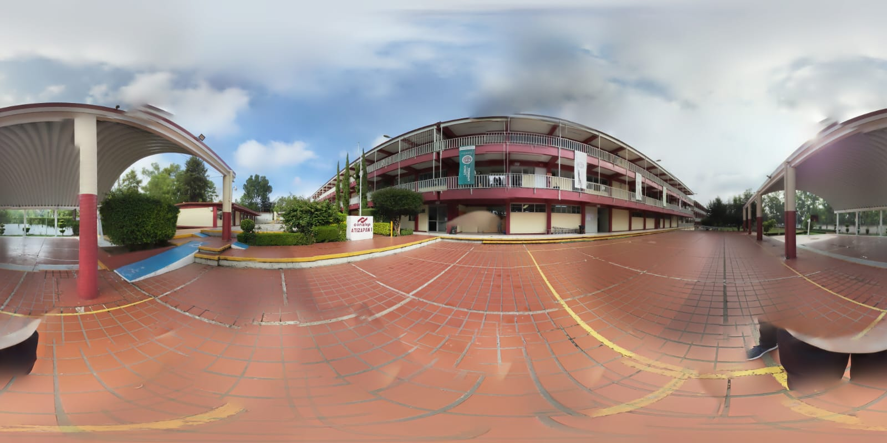

# Sistema de Generación Dinámica de Miniaturas

## Descripción General

Se ha implementado un sistema completo de generación dinámica de miniaturas que permite que todas las escenas del tour virtual se generen automáticamente desde la configuración (`config.js`), eliminando la necesidad de mantener manualmente el HTML de las miniaturas.

## Características Principales

### ✅ Ventajas del Sistema Dinámico

1. **Escalabilidad Automática**: Al agregar una nueva escena en `config.js`, automáticamente se genera su miniatura
2. **Mantenimiento Simplificado**: No es necesario editar HTML manualmente
3. **Consistencia**: Todas las miniaturas siguen el mismo formato y estructura
4. **Flexibilidad**: Fácil personalización de miniaturas por escena
5. **Orden Personalizable**: Las miniaturas se pueden ordenar según necesidades específicas

### 🔧 Funciones Implementadas

#### `generateThumbnails()`
- Genera todas las miniaturas dinámicamente desde `tourConfig.scenes`
- Aplica orden lógico predefinido
- Maneja casos especiales (Street View, iconos, tooltips)
- Asigna eventos de clic automáticamente

#### `markActiveThumbnail(sceneId)`
- Marca la miniatura activa de manera centralizada
- Elimina la clase `active` de todas las demás miniaturas
- Se usa en todas las funciones de cambio de escena

## Estructura de Configuración

### Formato de Escena en `config.js`

```javascript
'nombre-escena': {
    title: 'Título de la Escena',
    description: 'Descripción de la escena',
    panorama: 'assets/360/imagen.jpeg',
    thumbnail: {
        image: 'assets/360/imagen.jpeg',        // Imagen de la miniatura
        alt: 'Texto alternativo',               // Texto alt para accesibilidad
        displayName: 'Nombre a mostrar',        // Nombre en la miniatura
        isStreetView: false                     // Opcional: para Street View
    },
    // ... resto de configuración
}
```

### Casos Especiales

#### Street View
```javascript
'exterior': {
    // ... configuración normal
    thumbnail: {
        image: 'assets/360/exterior.svg',
        alt: 'Vista Exterior',
        displayName: 'Exterior (Maps)',
        isStreetView: true  // Activa icono de mapa
    }
}
```

## Orden de Miniaturas

El sistema utiliza un orden predefinido para organizar las miniaturas de manera lógica:

```javascript
const sceneOrder = [
    'plaza-roja', 'taller-autotronica', 'auditorio', 'edificio-b', 'edificio-c',
    'parque', 'cafeteria', 'arco-techo', 'cancha-futbol', 'exterior',
    'lab-computo-1', 'lab-computo-2', 'lab-computo-3', 'orientacion',
    'taller-mecatronica', 'aula-tipo', 'biblioteca', 'laboratorio',
    'direccion', 'informatica', 'estacionamiento'
];
```

## Cómo Agregar una Nueva Escena

### 1. Agregar Escena en `config.js`

```javascript
'nueva-escena': {
    title: 'Nueva Escena',
    description: 'Descripción de la nueva escena',
    panorama: 'assets/360/nueva-imagen.jpeg',
    thumbnail: {
        image: 'assets/360/nueva-imagen.jpeg',
        alt: 'Nueva Escena',
        displayName: 'Nueva Escena'
    },
    // ... resto de configuración
}
```

### 2. Agregar al Orden (Opcional)

Si quieres controlar la posición de la miniatura, agrega el ID al array `sceneOrder` en `generateThumbnails()`:

```javascript
const sceneOrder = [
    // ... escenas existentes
    'nueva-escena',  // Agregar donde desees
    // ... resto de escenas
];
```

### 3. ¡Listo!

La miniatura se generará automáticamente al cargar la página.

## Funciones Actualizadas

### `initializeThumbnails()`
- Ahora llama a `generateThumbnails()` al inicio
- Mantiene toda la funcionalidad de controles (minimizar, ocultar, etc.)
- Verifica que las miniaturas se generaron correctamente

### `updateSceneInfo(sceneId)`
- Usa `markActiveThumbnail(sceneId)` en lugar de lógica manual
- Más limpio y centralizado

### `initializeInitialScene()`
- Obtiene escenas dinámicamente desde `tourConfig.scenes`
- Usa `markActiveThumbnail()` para marcar la miniatura activa

### `setupThumbnailNavigation()`
- Simplificado para usar `markActiveThumbnail()`
- Los eventos principales se configuran en `generateThumbnails()`

## HTML Actualizado

### Antes (Manual)
```html
<div class="scene-thumbnails">
    <button class="thumbnail-btn" data-scene="plaza-roja">
        
        <span>Plaza Roja</span>
    </button>
    <!-- ... muchas más miniaturas manuales -->
</div>
```

### Después (Dinámico)
```html
<div class="scene-thumbnails" id="scene-thumbnails-container">
    <!-- Las miniaturas se generarán automáticamente desde config.js -->
</div>
```

## Beneficios del Sistema

### Para Desarrolladores
- ✅ Menos código duplicado
- ✅ Mantenimiento más fácil
- ✅ Menos errores de sincronización
- ✅ Escalabilidad automática

### Para Usuarios
- ✅ Experiencia consistente
- ✅ Todas las escenas siempre disponibles
- ✅ Navegación fluida
- ✅ Interfaz limpia y organizada

## Verificación del Sistema

### Logs de Consola
El sistema proporciona logs detallados para verificar su funcionamiento:

```
✅ Generando miniaturas dinámicamente...
✅ Se generaron 21 miniaturas dinámicamente
✅ Inicialización de miniaturas completada
✅ Miniaturas maximizadas
✅ Botón minimizar configurado correctamente
```

### Verificación Manual
1. Abrir la consola del navegador
2. Verificar que aparezcan los logs de generación
3. Confirmar que todas las miniaturas se muestran correctamente
4. Probar la funcionalidad de minimizar/ocultar
5. Verificar que el marcado activo funciona

## Troubleshooting

### Problema: No se generan miniaturas
**Solución**: Verificar que `tourConfig.scenes` esté definido correctamente

### Problema: Miniaturas sin imagen
**Solución**: Verificar que la ruta en `thumbnail.image` sea correcta

### Problema: Orden incorrecto
**Solución**: Modificar el array `sceneOrder` en `generateThumbnails()`

### Problema: Eventos no funcionan
**Solución**: Verificar que `generateThumbnails()` se llame antes que `initializeThumbnails()`

## Conclusión

El sistema de generación dinámica de miniaturas representa una mejora significativa en la mantenibilidad y escalabilidad del proyecto Virtual360. Ahora es mucho más fácil agregar nuevas escenas y mantener la consistencia en toda la aplicación.

---

**Fecha de Implementación**: 2025  
**Versión**: 6.0  
**Estado**: ✅ Completado y Funcional 